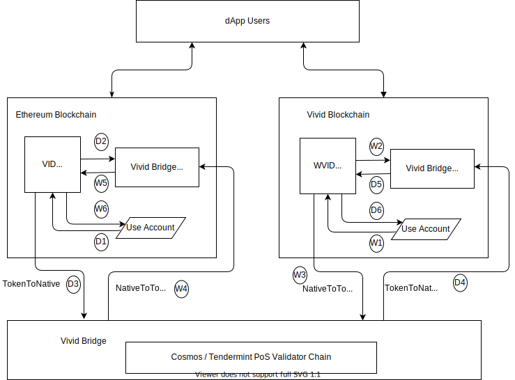
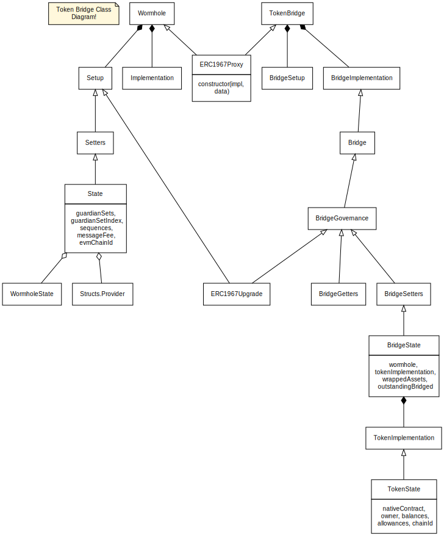

# vivid-bridge
**vivid-bridge** is a trustless crosschain bridge for Vivid blockchain for transefering ERC20-VID from Ethereum to Vivid.

Bridges as applications 'lock' assets on one chain in exchange for wrapped assets on another chain. The wrapped assets can then be exchanged for the original 'backing' asset. VivdBridge locks the ERC20VID on Ethereum Mainnet and issues WrappedVID on Vivid Network. The Wrapped VID is exchanged with Native VID. This will maintain the total supply of ERC20 VID i.e. the total NativeVID on Vivid Network is always equal to locked ERC20 VID,

# Blockchain bridges

A bridge between two blockchains that requires either a trusted intermediary, committee or an honest majority assumption to ensure that funds can’t be stolen. A trusted bridge can be exploited more easily than a trust-minimized bridge because it provides weaker guarantees for its security.


## Trusted vs Trustless Bridges
Trusted bridges depend upon a central entity or system for their operations. They have trust assumptions with respect to the custody of funds and the security of the bridge. Users mostly rely on the bridge operator's reputation. Users need to give up control of their crypto assets.

Examples of trusted bridges are the bridge for WBTC which is run by BitGo, a committee based bridge like Axelar, or the IBC bridge between Osmosis and the Cosmos Hub.

Trustless bridges operate using smart contracts and algorithms. They are trustless, i.e., the security of the bridge is the same as that of the underlying blockchain. Through smart contracts, trustless bridges enable users to remain in control of their funds.

## Examples of Trustless Bridges
### Polygon-PoS Bridge
Polygon brings you a trustless two-way transaction channel between Polygon and Ethereum by introducing the cross-chain bridge with PoS security. With this users can transfer tokens across Polygon without incurring third-party risks and market liquidity limitations. The Plasma and PoS Bridge is available on both Mumbai as well as Mainnet.
For more details refer [Ethereum↔Polygon Bridge](https://wiki.polygon.technology/docs/develop/ethereum-polygon/getting-started/)

### Solana Wormhole bridge
Wormhole V1  was initially conceived as a traditional token bridge between Ethereum and Solana. It served as the first bridge on Solana and was responsible for bootstrapping a large amount of the liquidity in the early Solana and Serum ecosystems. However, despite its beginnings as a token bridge, Wormhole quickly grew beyond Solana and token transfers.

Wormhole v2 launched in August 2021 as a decentralized generic interoperability protocol for multiple blockchain ecosystems with initial support for Solana, Terra, Ethereum and Binance Smart Chain.

For more details refer [Wormhole Bridge](https://book.wormhole.com/)

## Vivid-Bridge:  Proposed cross-chain bridge for Ethereum-Vivid 
We will build a trustless Ethereum-Vivid cross-chain bridge that has building blocks similar to that of Wormhole, but will be built form the Cosmos SDK instead of forking the Wormhole. 

We take an approach that the vivid-bridge provide minimal functionality for trustless bridging of VID token and expand it to other token assets and blockchains in future as the need arises.

---
# Operation


## Ethereum Mainnet to Vivid Network
* An account transfers ERC20-VID to VividBridgeBank contract on Ethereum (D1, D2)
* Retrieve the resulting TokenToNativeMessage from the VividBridge Network(D3)
* Call ExchangeContract on Vivid suppling TokenToNativeMessage(D4).
* WrappedVID is locked and recepient account is deposited with Native-VID

## Vivid Network to Ethereum Mainnet
* An account transfers Native-VID to VividBridgeBank on Vivid(W1, W2)
* Retrieve the resulting NativeToTokenMessage from the VividBridge Network(W3).
* Call VividBridgeBank Contract on Ethereum to process NativeToTokenMessage(W4).
* WrappedVID is locked in the bank and VID Token is deposites in the ERC20-VID for the account(W5, W6).

```
BridgeMessage(
    byte        version,
    u8          len_signatures,
    [][66]byte  signatures,

    u32         timestamp,
    int         nonce,
    u16         emitter_chain, 
    [32]byte    emitter_address,

    address     token,
    uint256     amount,
    uint16      recipientChain,
    bytes32     recipient,
    uint256     arbiterFee,
    bytes32     txn_hash
) returns int sequenceNumber

```
## Bridge Contracts

## References:

Wormhole Relayer
https://book.wormhole.com/wormhole/6_relayers.html

Blockchain bridges
https://ethereum.org/en/bridges/

Cross-Chain Execution
https://eips.ethereum.org/EIPS/eip-5164

Ethereum↔Polygon Bridge
https://wiki.polygon.technology/docs/develop/ethereum-polygon/getting-started/

Polygon Bor Fee Model
https://wiki.polygon.technology/docs/pos/bor/#bor-fee-model

How to Convert ERC-20 AXL to Native AXL
https://axelar.network/blog/how-to-convert-erc-20-axl-to-native-axl


Converting Native to ERC20 using Fetch.ai browser wallet
https://medium.com/fetch-ai/converting-native-to-erc20-using-fetch-ai-browser-wallet-97bb3f8b6b72

xp_network_nft_bridge
https://github.com/vechain/grant-program/blob/master/applications/xp_network_nft_bridge.md

Introducing Binance Bridge 2.0
https://www.binance.com/en/blog/ecosystem/introducing-binance-bridge-20-421499824684903626
